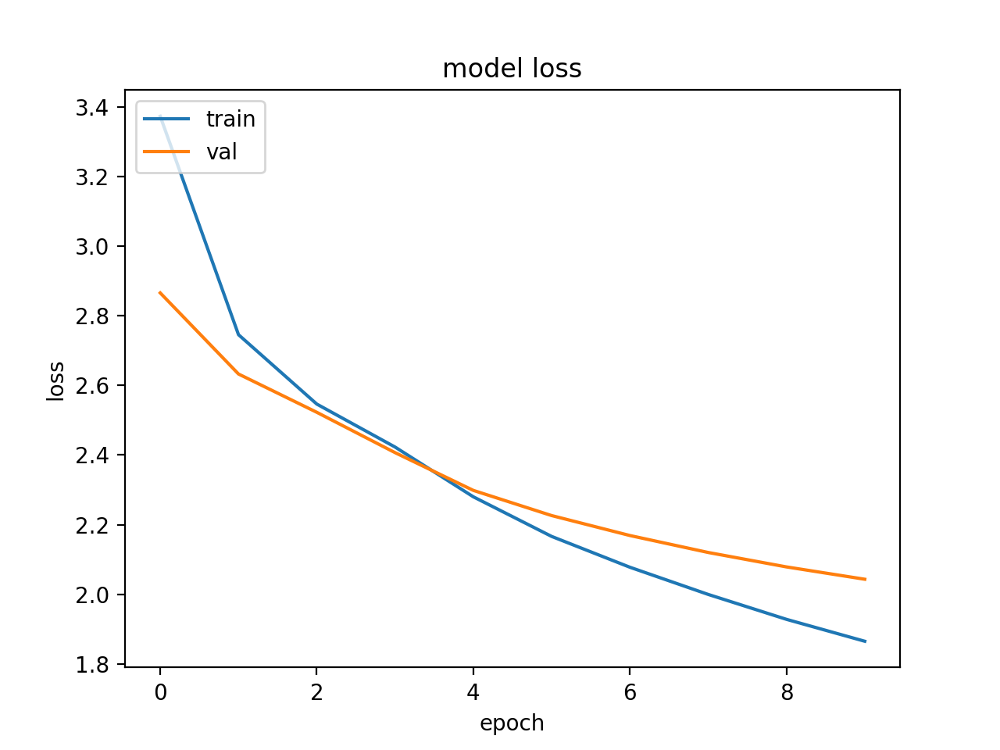
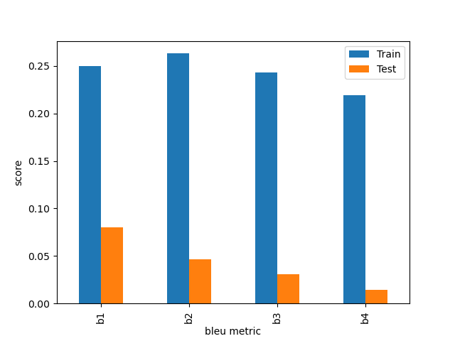

# Arabic-Image-Captioning

We implemented a seqeunce-to-sequence encoder-decoder model to generate Arabic captions for images. For our encoder, we leverage Transfer Learning by utilizing pre-trained VGG16 to extract feature vectors for images. For our decoder, we utilize a recurrent network, specifically a single-layer GRU. We trained our model using Teacher Forcing and generated captions for our testing using greedy search. 

Below are plots of our model loss and BLEU accuracy. We believe our model is currently overfitting, and based on our BLEU scores, our captions produce okay captions for training but unintelligible captions for testing.

